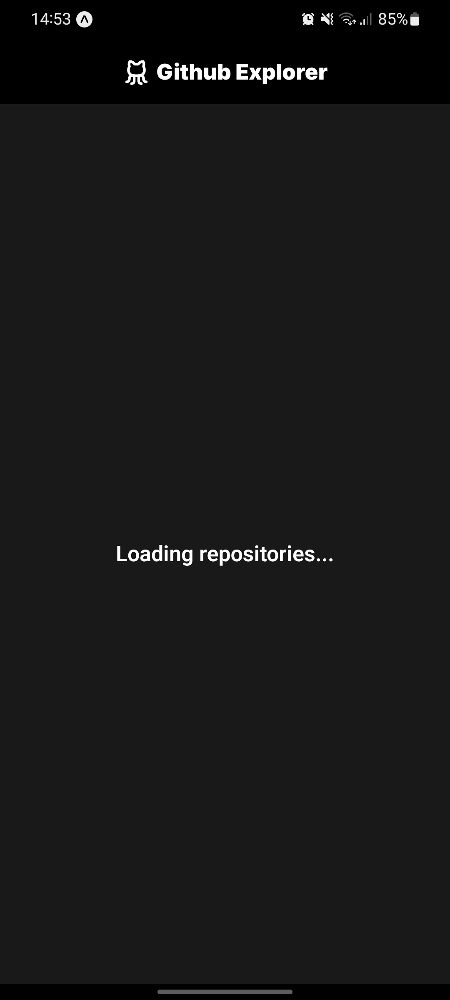

# ⚛️ Github Explorer - React Native

## 🔖 About

Version mobile the [Github Explorer project](https://github.com/TiagoM13/Github_Explorer_React).

Mobile application, listing of user repositories using the github api for data query.

## 📷 Layout

   
   

## 🛠️ Tools
   - [Expo](https://docs.expo.dev/)
   - [React Native](https://reactnative.dev/) 
   - [Typescript](https://www.typescriptlang.org/)
   - [React Native Dotenv](https://www.npmjs.com/package/react-native-dotenv)
   - [Phosphor React Native](https://github.com/duongdev/phosphor-react-native)
   - [React Query](https://tanstack.com/query/v3/)
   - [Axios](https://axios-http.com/)

### 🚀 Finished project.
